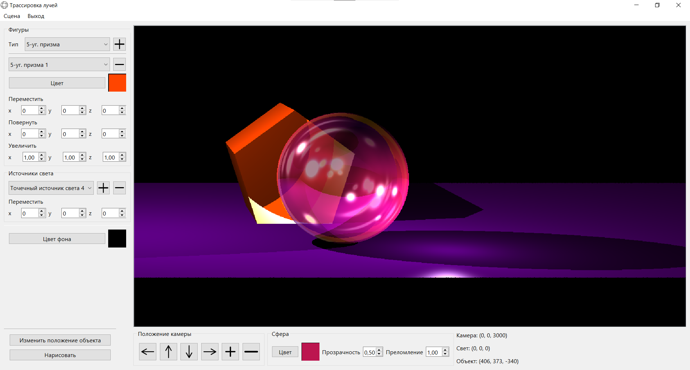
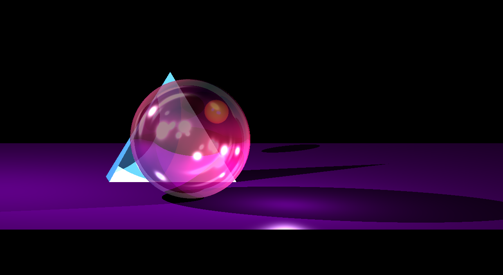
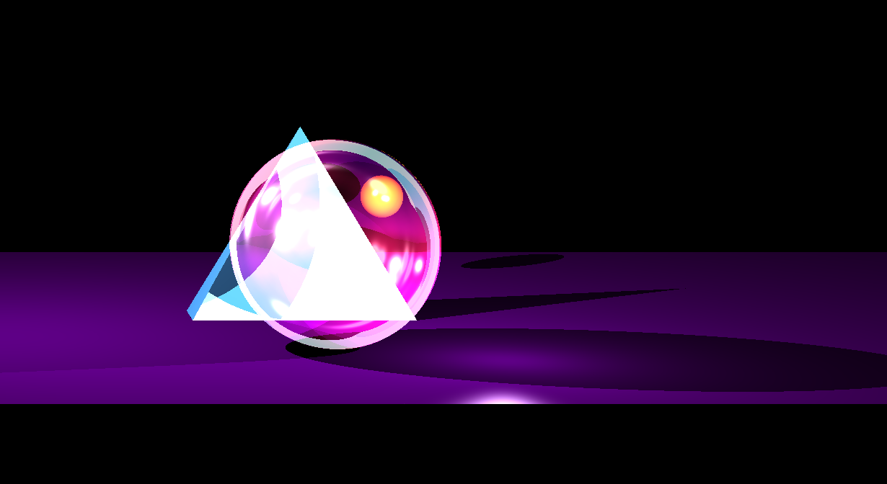

# BMSTU-CG-Course
ИУ7, 5 сем, курсовая по компьютерной графике (2022)

Визуализация геометрических объектов за полупрозарачной сферой.   
Выполненно с помощью обратной трассировки лучей.   
Есть возможность добавлять различные правильные геометрические объекты на сцену (сферы, призмы, пирамиды), менять им цвета и их расположение, менять цвет фона. 
У сферы можно можно менять прозрачность, цвет и коэффициент преломления, добавлять точечные источники света и двигать их. Еще можно подвигать камеру, но ведет себя переодически очень неадекватно

Исследование - скорость синтеза изображения разного размера от количества потоков. Тут нет кода, проводящего это исследование.    
По умолчанию запускается многопоточная реализация, количество потоков указано в аргументах функции отрисовки

Интерфейс: 

И пара примеров:

Анимация: 

Код генерации анимации находится в файле [`src/main.cpp`](src/main.cpp)

Больше примеров [здесь](docs/tex/img) - файлы с названием `ex*.png`
